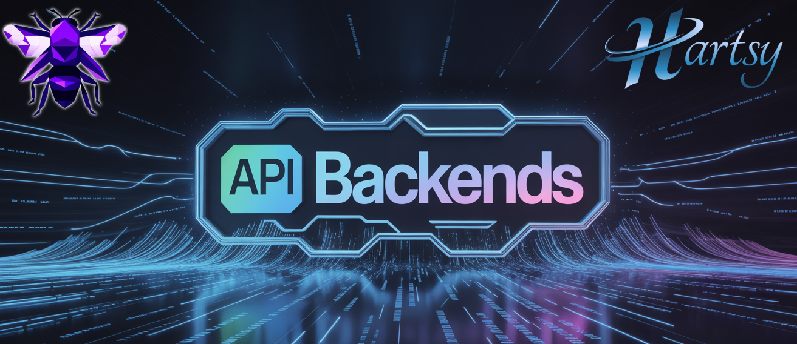

# SwarmUI APIBackends Extension
---------------


## Table of Contents
-----------------

1. [Introduction](#introduction)
2. [Features](#features)
3. [Prerequisites](#prerequisites)
4. [Installation](#installation)
5. [Usage](#usage)
6. [Configuration](#configuration)
7. [Architecture](#architecture)
8. [API](#api)
9. [Troubleshooting](#troubleshooting)
10. [Changelog](#changelog)
11. [License](#license)
12. [Contributing](#contributing)
13. [Acknowledgments](#acknowledgments)

## Introduction
---------------

The APIBackends Extension for SwarmUI enables integration with multiple commercial image and video generation APIs. It registers API-hosted models into SwarmUI's normal model list so they can be selected and used from the **Generate** tab like local models.

- Generate images using DALL-E 3 or GPT Image 1.5
- Access Black Forest Labs' Flux models
- Generate with Ideogram V3
- Create videos with Seedance 2.0, Sora 2, Veo 3.1, Kling, and more via Fal.ai
- Use utility models for background removal, upscaling, and face restoration
- Seamlessly switch between different API providers

> [!WARNING]
> API usage incurs costs from the respective providers. Make sure you understand the pricing before use.
> Always keep your API keys secure and never share them.

## Features
------------

* Currently supports 6 API providers:
  - OpenAI (DALL-E 2, DALL-E 3, GPT Image 1, GPT Image 1.5, Sora)
  - Ideogram (V1, V2, V2 Turbo, V3)
  - Black Forest Labs (FLUX Pro, Ultra, Dev, Kontext Pro/Max, FLUX 2 Pro/Max)
  - Grok (Grok 2 Image)
  - Google (Imagen 3.0, Gemini 2.0 Flash, Gemini 2.5 Flash, Gemini 3.1 Flash, Gemini 3 Pro)
  - Fal.ai (130+ models -- image, video, and utility -- via a single API key)
* Provider-specific parameter controls that show/hide automatically per model
* Video generation support (Seedance 2.0, Sora 2, Veo 3.1, Kling, Grok Video, Hailuo, PixVerse, Wan, and more)
* Utility models for background removal, image/video upscaling, and face restoration
* Secure per-user API key management
* Custom base URL support for enterprise deployments
* Permission system integration for access control

### Fal.ai Model Catalog

Fal.ai acts as a unified gateway to models from many providers. With a single Fal API key you get access to all of them.

**Image Models** include FLUX (dev, schnell, pro, ultra, kontext, flex, lora, general), Recraft V3, Ideogram (V2, V2a, V3), Stability AI (SD 3.5, SDXL Lightning, Stable Cascade), Grok, Google (Nano Banana Pro, Imagen 3, Gemini Flash), Kling (V3, O3), Qwen, Bria (Fibo), ByteDance Seedream, Reve, ImagineArt, F-Lite, HiDream (I1, E1), OmniGen, AuraFlow, Lumina, Sana, Playground, Kolors, MiniMax, Step1X, Hunyuan, UNO, and Instant Character.

**Video Models** include ByteDance Seedance (2.0, 2.0 Fast, 1.0 Pro, 1.0 Lite -- T2V, I2V, and Ref2V), Sora 2, Veo (3.1, 3, 2), Kling (O3 Pro/Std, V3 Pro/Std, V2.5 Turbo Pro), Grok Video, MiniMax Hailuo, PixVerse V5, Wan 2.2, LTX, Vidu Q3, Hunyuan, Mochi, Luma Ray 2, Pika V2.2, Kandinsky 5 Pro, Magi, CogVideoX, SkyReels, and Decart Lucy.

**Utility Models** include background removal (rembg, Bria RMBG 2.0, BEN V2), upscaling (Clarity, Topaz, Creative Upscaler, ESRGAN, Topaz Video), face restoration (CodeFormer), and video background removal (Bria Video BG Removal).

> [!NOTE]
> Future Features:
> - Additional API providers and models
> - Batch processing optimization
> - Cost estimation before generation
> - Usage tracking and reporting

## Prerequisites
----------------

Before installing the APIBackends Extension, ensure you have:
- SwarmUI installed and running
- Valid API keys for the services you plan to use
- Understanding of the associated costs and usage limits

## Installation
--------------

### Preferred Method (Via SwarmUI)

1. Open your SwarmUI instance
2. Navigate to the **Server** > **Extensions** tab
3. Find "SwarmUI-API-Backends" in the list
4. Click the **Install** button
5. Restart SwarmUI when prompted

### Manual Installation

If you prefer to install manually:

1. Close SwarmUI
2. Navigate to the `SwarmUI/src/Extensions` directory
3. Clone the repository:
   ```bash
   git clone https://github.com/HartsyAI/SwarmUI-API-Backends.git
   ```
4. Rebuild SwarmUI:
   - **Windows:** run `update-windows.bat` from the SwarmUI root
   - **Linux/Mac:** run `update-linuxmac.sh` from the SwarmUI root
5. Start SwarmUI and refresh your browser

## Usage
--------

### 1. Add Your API Keys

1. Go to the **User** tab
2. Scroll to the API key section -- you will see entries for each provider
3. Paste your API key for each provider and click **Save**

### 2. Add a Backend

1. Go to the **Server** tab > **Backends**
2. Click **Add New Backend**
3. Select **3rd Party Paid API Backends**
4. Toggle the providers you want to use:
   - Enable Black Forest Labs (Flux)
   - Enable Ideogram
   - Enable OpenAI
   - Enable Grok
   - Enable Google
   - Enable Fal.ai
5. Click **Save** then **Restart Backend**

### 3. Generate

1. Go to the **Generate** tab
2. Open the model dropdown -- API models appear under `API Models/<Provider>/...`
   - Example: `API Models/OpenAI/dall-e-3`, `API Models/Fal/Sora/sora-2-t2v`
3. Select a model -- provider-specific parameters appear automatically
4. Enter a prompt and click **Generate**

Video outputs are saved as `.mp4` files. Image outputs follow your normal image format settings.

## Configuration
----------------

This extension uses two configuration surfaces:

- **Backend settings** (Server-side)
  - Enable/disable providers via toggle switches
  - Optional: set a custom base URL override
- **User API keys** (Per-user)
  - Each provider has a dedicated API key entry
  - Keys are stored in SwarmUI user data (never hardcode keys in code)

### Providers

Each API provider requires an API key. Get yours here:

| Provider | Get API Key |
|---|---|
| OpenAI (ChatGPT) | https://platform.openai.com/api-keys |
| Black Forest Labs (FLUX) | https://dashboard.bfl.ai/ |
| Ideogram | https://developer.ideogram.ai/ideogram-api/api-setup |
| Grok (xAI) | https://accounts.x.ai/ |
| Google (Imagen, Gemini) | https://ai.google.dev/gemini-api/docs/api-key |
| Fal.ai | https://fal.ai/dashboard/keys |

### Provider Parameters

Parameters are shown/hidden automatically based on which model you select.

* **OpenAI:** Image Size, Quality, Style (DALL-E 3), Background (GPT Image), Output Format, Moderation, Output Compression
* **Ideogram:** Aspect Ratio, Style Type, Magic Prompt, Rendering Speed, Image Remix Weight, Color Theme, Negative Prompt, Image Prompt (for editing)
* **Black Forest Labs:** Width, Height, Guidance, Steps, Prompt Enhancement, Raw Mode, Image Prompt, Safety Filter Level, Output Format
* **Grok:** Aspect Ratio, Output Resolution
* **Google:** Aspect Ratio, Person Generation, Image Size (Imagen), Image Resolution (Gemini 3)
* **Fal.ai Image:** Image Size, Aspect Ratio, Resolution, Guidance Scale, Inference Steps, Seed, Output Format, Safety Checker, Negative Prompt, Recraft Style
* **Fal.ai Video:** Each video model family has its own parameter set with model-specific Duration, Aspect Ratio, Resolution, Generate Audio, and Negative Prompt options. Supported families: Seedance 2.0, Seedance 1.0, Sora, Kling, Veo, Luma, MiniMax, Hunyuan, and generic (Wan, Pika, PixVerse, etc.)
* **Fal.ai Seedance Ref2V:** Reference Image URLs, Reference Video URLs, Reference Audio URLs (for multi-reference video generation)

## Architecture
---------------

This extension uses a data-driven factory pattern to keep providers modular and scalable.

```
SwarmUI-API-Backends/
  Backends/
    APIAbstractBackend.cs      -- Base class for API backends
    DynamicAPIBackend.cs       -- Runtime backend that routes to providers
    APIProviderInit.cs         -- Builds provider metadata from definitions
  Models/
    ModelDefinition.cs         -- Model data structure + fluent builder
    ModelFactory.cs            -- Converts definitions to SwarmUI T2IModel
    APIProviderMetadata.cs     -- Provider metadata + request config
    APIProviderRegistry.cs     -- Singleton registry of all providers
    IProviderSource.cs         -- Interface for provider sources
  Providers/
    ProviderDefinitions.cs     -- Aggregates all provider definitions
    RequestBuilder.cs          -- Provider-specific request/response logic
    OpenAI.cs                  -- OpenAI provider (DALL-E, GPT Image)
    BlackForestLabs.cs         -- BFL provider (FLUX models)
    Ideogram.cs                -- Ideogram provider
    Grok.cs                    -- Grok/xAI provider
    Google.cs                  -- Google provider (Imagen, Gemini)
    Fal.cs                     -- Fal.ai provider (130+ models)
  Assets/
    api-backends.js            -- UI parameter visibility (feature flags)
  SwarmUIAPIBackends.cs        -- Extension entry point, param registration
```

**How it works:**

1. Each provider class (e.g., `OpenAI.cs`, `Fal.cs`) implements `IProviderSource` and defines its models
2. `ProviderDefinitions` aggregates all provider sources into a single list
3. `APIProviderInit` + `ModelFactory` convert these into SwarmUI-compatible `T2IModel` objects
4. `DynamicAPIBackend.Init()` registers models only for the providers you enabled
5. When you generate, `DynamicAPIBackend` routes to the correct provider and uses `RequestBuilder` to call the API
6. `api-backends.js` controls which parameters are visible based on the selected model's feature flags

### Model naming / UI grouping

API models are registered with names like:

- `API Models/<Provider>/<ModelId>`

This groups all API-backed models under a single top-level folder in the model selector. Fal.ai models include a subfolder for the original provider, e.g. `API Models/Fal/Sora/sora-2-t2v` or `API Models/Fal/ByteDance/seedance-2.0-t2v`.

## API
------

This extension does **not** add brand-new HTTP routes. Instead, it integrates into SwarmUI's existing WebAPI in two places:

### 1) Model listing and metadata (ModelsAPI)

The backend registers an extra model provider via `ModelsAPI.ExtraModelProviders["dynamic_api_backends"]`. This makes API models appear as **remote models** in the normal model browser.

Relevant Swarm API calls (names as registered by SwarmUI; typically available at `/API/<CallName>`):

- **`ListModels`**
  - Purpose: list models in folders (includes API models when `allowRemote=true`)
  - Key inputs:
    - `path` (folder)
    - `depth`
    - `subtype` (usually `Stable-Diffusion`)
    - `allowRemote` (must be `true` to include API models)
- **`DescribeModel`**
  - Purpose: get metadata for a single model (works for API models too)
  - Key inputs:
    - `modelName`
    - `subtype`

### 2) Generate tab params + generation (T2IAPI)

Provider-specific parameters are registered into SwarmUI's parameter system and are returned through:

- **`ListT2IParams`**
  - Purpose: returns all T2I parameters, param groups, and model lists used by the Generate tab.

Actual generation uses SwarmUI's standard generation endpoints. This extension participates by providing a backend that can service requests for models under `API Models/...`:

- **`GenerateText2Image`**
- **`GenerateText2ImageWS`** (WebSocket live updates)

In requests, set the `model` parameter to an API model name, for example:

- `model: "API Models/Ideogram/V_3"`
- `model: "API Models/BFL/flux-2-max"`
- `model: "API Models/Fal/Sora/sora-2-t2v"`
- `model: "API Models/Fal/ByteDance/seedance-2.0-t2v"`

## Troubleshooting
-----------------

**No API models in the model list**
- Make sure at least one provider is enabled in the backend settings
- Check that you clicked **Save** and restarted the backend
- Look at the SwarmUI server logs for initialization errors

**"API key not found" error**
- Go to the **User** tab and add your key for the provider you're trying to use
- Make sure the key is saved (click Save after pasting)

**API request failed (4xx/5xx errors)**
- Verify your API key is valid and has credits/balance
- Check the server logs for the full error response from the provider
- Some providers have rate limits -- wait and retry

**Content policy violation**
- Some providers (e.g., ByteDance Seedance) have strict content filters that run server-side
- The video may be fully generated before being rejected, which can still incur costs
- Adjust your prompt to avoid content that may trigger safety filters

**Video generation completes but no output appears**
- Check server logs for errors
- Ensure you're using a video model (IDs ending in `-t2v`, `-i2v`, or `-ref2v`)

**Parameters not showing/hiding correctly**
- Hard-refresh your browser (`Ctrl+Shift+R`)
- Switch to a different model and back

For further help, join the [Hartsy Discord Community](https://discord.gg/nWfCupjhbm).

## Changelog
------------

* Version 1.3: ByteDance Seedance video models (2.0, 1.0 -- T2V, I2V, Ref2V), toggle switch UI for backend settings, expanded utility model catalog, content policy troubleshooting
* Version 1.2: Fal.ai video generation support (120+ models), automatic parameter visibility per model type, video output as .mp4
* Version 1.1: Modular provider/model factory architecture, unified `API Models/<Provider>/...` model naming

## License
----------

This extension is licensed under the [MIT License](https://opensource.org/licenses/MIT).

## Contributing
--------------

Contributions welcome! Please submit Pull Requests or open Issues on the [GitHub repo](https://github.com/HartsyAI/SwarmUI-API-Backends).

## Acknowledgments
-----------------

* [mcmonkey](https://github.com/mcmonkey4eva) for creating SwarmUI
* The API providers for their services and documentation
* The Hartsy development team
* [Hartsy AI](https://hartsy.ai) community for testing and feedback
